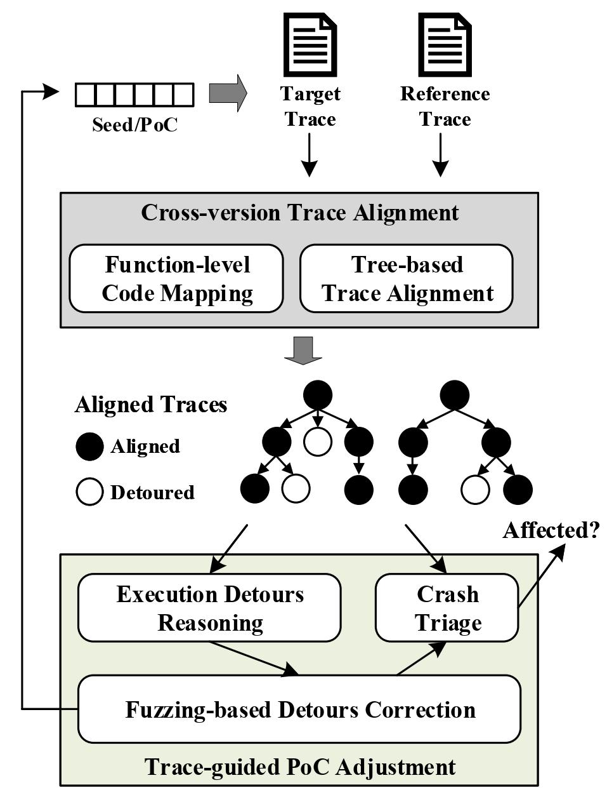

## Abstract

Recent research shows that, even for vulnerability reports archivedby MITRE/NIST, they usually contain incomplete information aboutthe software’s vulnerable versions, making users of under-reported vulnerable versions at risk. In this work, we address this problemby introducing a fuzzing-based method. Technically, this approach first collects the crashing trace on the reference version of the software. Then, it utilizes the trace to guide the mutation of the PoC input so that the target version could follow the trace similar to the one observed on the reference version. Under the mutated input, we argue that the target version’s execution could have a higher chance of triggering the bug and demonstrating thevulnerability’s existence. We implement this idea as an automatedtool, named **VulScope**. Using 30 real-world CVEs on 470 versions of software, VulScope is demonstrated to introduce no false positives and only 7.9% false negative while migrating PoC from one version to another. Besides, we also compare our method with two representative fuzzing tools AFL and AFLGO. We find VulScope outperforms both of these existing techniques while taking the task of PoC migration. Finally, by using VulScope, we identify 330 versions of software that MITRE/NIST fails to report as vulnerable.

## Approach Overview

Following the above key ideas, we design VulScope to facilitate the assessment of vulnerable versions. The overall architecture of VulScope is presented in Figure 1, consisting of two main modules that implement our key techniques respectively. Overall speaking, VulScope takes a PoC that triggers a vulnerability on the reference version as input, and tests whether another version of the same software is also vulnerable to this vulnerability. To confirm the vulnerability,VulScope should generate a new PoC that can indeed trigger the same vulnerability on the specified version. Our core idea is to adopt a trace-aware fuzzing method that continuously adjusts the given PoC, and make the target version of the software follow a similar path to that observed on the reference version under the new input. Following this way, intuition suggests that we have a higher chance to generate a new PoC that triggers the same vulnerability on the target version. 

In particular, VulScope runs in the following steps:
- Step-1: VulScope collects *Tref*  and *Ttarget* with the given PoC on the reference version and the target version, respectively.
- Step-2: VulScope performs cross-version trace alignmenton *Tref* and *Ttarget* to get the aligned functions between the two traces.
- Step-3: If a crash is observed on the target version, VulScope uses crash triage to verify whether this crash is triggered by the target vulnerability.
- Step-4: Based on the aligned cross-version execution traces, VulScope performs execution detours reasoning to locate the critical variables that cause these execution detours.
- Step-5: VulScope uses fuzzing-based detours correction to mutate the input bytes that are related to the critical variables.
- Step-6: All the mutated inputs are evaluated with the crash triage and given scores based on the similarity between their traces and *Tref*. If none of the seeds triggers the target vulnerability, they are inserted into a prioritization queue according to their scores. The seed with the highest score will be selected for next round of mutation (goto Step-4).

<b>Figure 1: System Overview for PoC Migration</b>

## Implementation

(coming soon)

## Research Paper

[<u>ACM CCS 2021</u>] **Facilitating Vulnerability Assessment through PoC Migration**

*Jiarun Dai, Yuan Zhang, Hailong Xu, Haiming Lyu, Zicheng Wu, Xinyu Xing, Min Yang.*

To appear in the 28th ACM Conference on Computer and Communications Security (CCS), Seoul, South Korea, November 14-19, 2021 (coming soon).

## Team

Jiarun Dai, Ph.D student, CS, Fudan University

Hailong Xu, M.S. student(Graduated), CS, Fudan University

[Yuan Zhang](https://yuanxzhang.github.io/), Associate Professor, CS, Fudan University

Haiming Lyu, M.S. student, CS, Fudan University

Zicheng Wu, M.S. student, CS, Fudan University

[Xinyu Xing](http://xinyuxing.org/), Assistant Professor, IST, Pennsylvania State University

Min Yang, Professor, CS, Fudan University

