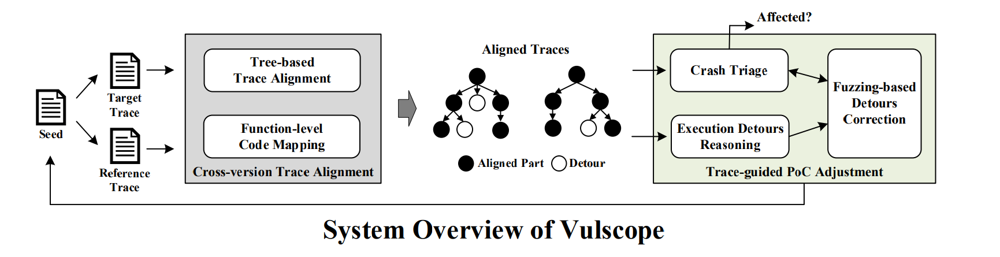

# VulScope: Facilitating Vulnerability Assessment through PoC Migration

## Research Problem

A public vulnerability report usually contains vulnerable software versions, the severity of the vulnerability, and even the Proof-of-Concept (PoC) input to  reproduce  the  failure  pertaining  to  the  vulnerability. However, recent research[[1,2,3]](#reference) shows that incomplete and incorrect vulnerable software versions are prevalent in vulnerability reports, making users of under-reported vulnerable versions at risk. 

Existing techniques such as code clone detection and patch presence testing could potentially be applied to verifying a vulnerability on different software versions. However, these static analysis techniques might generate high false positives because they cannot confirm the existence of the vulnerability through a PoC that triggers the target vulnerability.

In this work, we introduce a systematic, automated approach to assessing the under-reported vulnerable versions for a reported vulnerability. Technically, taking a PoC for the reference vulnerable version as input, we utilize a fuzzing-based method to generate a new PoC for the target version to trigger the same vulnerability. We implement this idea as an automated tool, named VulScope. On 30 real-world CVEs, VulScope successfully identify **330**
versions of software that MITRE/NIST fails to report as vulnerable.

We plan to release the [source code](#source-code) and [datasets](#dataset) of VulScope, see [our sharing policy](#open-source-protocol) for more details.

## Approach Overview

To solve the problem mentioned above, we introduce an automated tool, VulScope, implemented a trace-aware fuzzing method that continuously adjust the reference PoC  to maximize the similarity between the execution trace generated by the reference PoC and the one generated by the adjusted PoC on the target version. Following this way,  we have a higher chance to generate a new PoC that triggers the same vulnerability on the target version.

In particular, VulScope runs in the following steps:

1. VulScope collects *Tref* (Reference Trace) and *Ttarget* (Target Trace) with the given PoC on the reference version and the target version, respectively.

2. VulScope performs cross-version trace alignmenton *Tref* and *Ttarget* to get the aligned functions between the two traces.

3. If a crash is observed on the target version, VulScope uses crash triage to verify whether this crash is triggered by the target vulnerability.

4. Based on the aligned cross-version execution traces, VulScope performs execution detours reasoning to locate the critical variables that cause these execution detours.

5. VulScope uses fuzzing-based detours correction to mutate the input bytes that are related to the critical variables.

6. All the mutated inputs are evaluated with the crash triage and given scores based on the similarity between their traces and *Tref*. If none of the seeds triggers the target vulnerability, they are inserted into a prioritization queue according to their scores. The seed with the highest score will be selected for next round of mutation (goto Step-4).

## Paper Info

[ACM CCS 2021] **Facilitating Vulnerability Assessment through PoC Migration**

*Jiarun Dai, Yuan Zhang, Hailong Xu, Haiming Lyu, Zicheng Wu, Xinyu Xing, Min Yang.*

To appear in the 28th ACM Conference on Computer and Communications Security (CCS), Seoul, South Korea, November 14-19, 2021 (coming soon).

## Citation

(coming soon)

## Open Source Protocol

Recent research shows that, public vulnerability reports (e.g., those achieved by MITRE/NIST) usually contain incomplete information about the software's vulnerable versions, making users of under-reported vulnerable versions at risk. In light of this, we are glad to release our tool VulScope and dataset for vulnerability assessment to the community, to better understand or mitigate this problem. However, to avoid misuse of our tool and dataset, we apply simple authentication to verify the identity of the user who wants to request access to our source code and dataset. So, if you are interested in VulScope and want to obtain access to our source code and dataset, please read the following instructions and send your request email to Yuan Zhang (yuanxzhang@fudan.edu.cn) and Jiarun Dai (jrdai14@fudan.edu.cn).

**=======  Instructions about Request Email =======**

**For Academic Researchers:**
If you are a student(or postdoc), please have your advisor (or host) send us an access email. If you are a faculty member, please send us an email from your university email account.

In your email, please include your name, affiliation, and home page (if we do not recognize each other). This information is required only for verification purposes. Please note that if we are unable to determine your identity or affiliation, your request may be ignored.

If your papers or articles use our dataset or our tool, please cite our CCS 2021 paper.

**For Industry Researchers:**
If you are currently in industry (including research labs), please send us an email from your company's email account.

In the email, please briefly introduce yourself (e.g., name and title - in case we don't know each other) and your company.

**Mail Content:**
In the email, please include a justification letter (PDF format) on official letterhead. The justification letter needs to acknowledge the "VulScope" project from Fudan University and clearly state the reason for requesting the dataset or source code. Also, confirm that the dataset or source code will not be shared with others without our permission.

We emphasize that we will ignore emails that do not follow the above instructions. Please note that we may disclose on the homepage of VulScope(https://seclab-fudan.github.io/VulScope) the list of universities, research labs, and companies that have requested our datasets. Again, you are not allowed to share any samples from our source code/dataset with others without our permission. Sending us an email requesting access to our source code/dataset implies that you are aware of and agree to the above policy.

## Dataset

When evaluating the performance of VulScope, we randomly selected 30 real-world CVE reports from the National Vulnerability Database (NVD). These 30 CVEs influence 6 broadly adopted software  in  the  user space,  covering  6  types  of  vulnerabilities: heap OOB, stack OOB, divide-by-zero, segmentation fault, integer overflow, and null pointer dereference. As shown in the following table, the dataset consists of 30 reference CVE-version pairs and 470 target CVE-version pairs.

We plan to open source this dataset, containing the inputs needed by VulScope to run tests on these CVE-version pairs. Following our sharing protocol, you can get the dataset in a public [zenodo repository](). 

## Source Code

We also plan to make the source code of all modules of VulScope publicly available. For ease of use, we also provide the docker images in which you can directly run our tool. You can get the source code and docker images from a public [zenodo repository](), following our sharing policy.

## Team Members

- Jiarun Dai, Ph.D student, CS, Fudan University

- Hailong Xu, M.S. student(Graduated), CS, Fudan University

- [Yuan Zhang](https://yuanxzhang.github.io/), Associate Professor, CS, Fudan University

- Haiming Lyu, M.S. student, CS, Fudan University

- Zicheng Wu, M.S. student, CS, Fudan University

- [Xinyu Xing](http://xinyuxing.org/), Assistant Professor, IST, Pennsylvania State University

- Min Yang, Professor, CS, Fudan University

## Reference

[1] Oscar Chaparro, Jing Lu, Fiorella Zampetti, Laura Moreno, Massimiliano Di Penta,Andrian Marcus, Gabriele Bavota, and Vincent Ng. 2017.  Detecting MissingInformation in Bug Descriptions. InProceedings of the 11th Joint Meeting onFoundations of Software Engineering (FSE), Paderborn, Germany. 396–407.

[2] Ying Dong, Wenbo Guo, Yueqi Chen, Xinyu Xing, Yuqing Zhang, and Gang Wang.2019. Towards the Detection of Inconsistencies in Public Security VulnerabilityReports. InProceedings of the 28th USENIX Security Symposium (USENIX Security),Santa Clara, CA, USA. 869–885

[3] Dongliang Mu, Alejandro Cuevas, Limin Yang, Hang Hu, Xinyu Xing, Bing Mao,and Gang Wang. 2018. Understanding the Reproducibility of Crowd-reportedSecurity Vulnerabilities. InProceedings of the 27th USENIX Security Symposium(USENIX Security), Baltimore, MD, USA. 919–936

